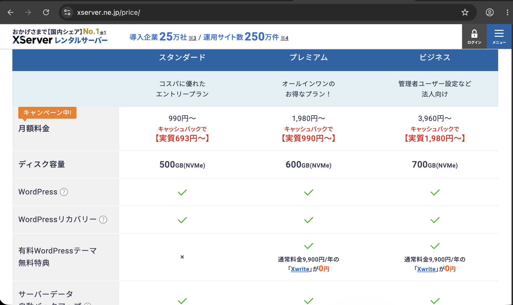
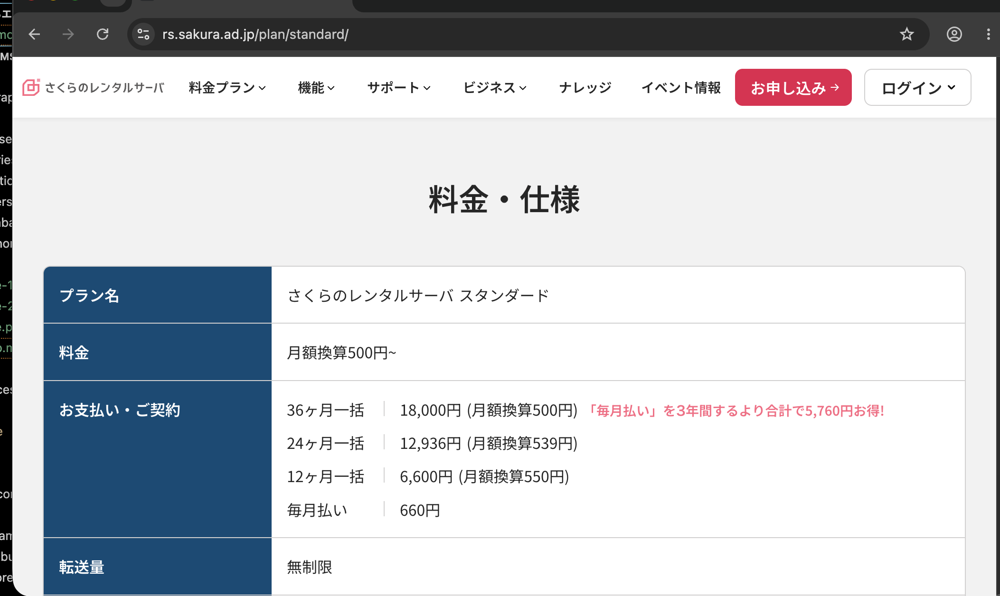

# ホームページ運用に必要なもの・料金比較

## ホームページ公開に必要なもの

| 項目 | 内容 | 必要 |
|------|------|:---:|
| ドメイン | ホームページの住所（例：○○.com） | ✔ |
| レンタルサーバー | ホームページのデータを保存・公開するサーバー | ✔ |
| SSL証明書 | 通信を暗号化し、https://で表示するため | ✔ |
| メールアドレス | info@○○.com などの独自メール | ○ |
| CMS | お知らせ・メニュー・スタッフ情報などを更新する管理画面 | ✔ |
| データベース | CMSで登録した内容を保存 | ✔ |
| バックアップ | 万が一に備えたデータ保護 | 推奨 |

---

# レンタルサーバー比較

| 項目 | Xserver | さくらレンタルサーバー |
|------|---------|----------------------|
| 公式サイト | https://www.xserver.ne.jp/ | https://rs.sakura.ad.jp/ |
| 月額料金（目安） | 約990円～ | 約500円～ |
| 年額料金（目安） | 約11,880円～ | 約6,000円～ |
| ドメイン無料特典 | ○（対象ドメイン永久無料あり） | × |
| SSL | 無料 | 無料 |
| 独自メール | ○ | ○ |
| データベース（MySQL） | ○ | ○ |
| Laravel対応 | ○ | ○ |
| WordPress対応 | ○ | ○ |
| 自動バックアップ | ○ | ○ |
| 初心者向け | ◎ | ○ |


<p float="left">
  
  
</p>

※料金は2026年8月時点のプランを参考にしています。契約期間やキャンペーンにより変動する場合があります。

---

# ドメイン費用

レンタルサーバーとは別に、ホームページの住所（ドメイン）が必要です。

| ドメイン | 年額目安 |
|----------|---------:|
| .com | 約1,500～2,000円 |
| .jp | 約3,000～4,000円 |
| .net | 約1,500～2,000円 |

※Xserverでは契約プランにより対象ドメインが永久無料になる場合があります。

---

# 年間費用の目安

## パターン1：Xserver（おすすめ）

| 内容 | 年額 |
|------|------:|
| レンタルサーバー | 約11,880円 |
| ドメイン | 0～2,000円（無料特典対象の場合は0円） |
| SSL | 無料 |
| メール | 無料 |

**年間：約12,000円前後**

---

## パターン2：さくらレンタルサーバー

| 内容 | 年額 |
|------|------:|
| レンタルサーバー | 約6,000円 |
| ドメイン | 約2,000円 |
| SSL | 無料 |
| メール | 無料 |

**年間：約8,000円前後**

---

# おすすめ構成

```
おすすめ構成
   │
https://○○.com
   │
ドメイン
   │
レンタルサーバー
   │
ホームページ
   │
管理画面（CMS）
   │
データベース
```

---

# おすすめ

## Xserver

**こんな方におすすめ**

- 管理をシンプルにしたい
- 表示速度を重視したい
- 将来的に機能追加も考えている

---

## さくらレンタルサーバー

**こんな方におすすめ**

- 初期費用・維持費を抑えたい
- シンプルなホームページを運営したい

---

## CMSについて

管理画面（CMS）を導入することで、ご自身で以下の更新が可能です。

- お知らせ
- スタッフ紹介
- メニュー
- ギャラリー
- ブログ
- キャンペーン情報

ブラウザから更新できます。

---

# システム構成イメージ

```text
                お客様（閲覧者）
                       │
                       ▼
              https://○○.com
                       │
                  ドメイン
                       │
                       ▼
              レンタルサーバー
                       │
         ┌──────────────┴──────────────┐
         │                             │
         ▼                             ▼
  ホームページ（公開サイト）      管理画面（CMS）
                                       │
                                       ▼
                              データベース（MySQL）
```

管理画面（CMS）から登録・更新した内容が、ホームページへ自動的に反映されます。

---

# 管理画面（CMS）の主な機能

| 機能 | 内容 |
|------|------|
| お知らせ管理 | 新着情報の登録・編集 |
| メニュー管理 | メニュー・料金の更新 |
| スタッフ管理 | スタッフ情報・写真の登録 |
| ギャラリー管理 | 店内・施術写真の掲載 |
| ブログ管理 | ブログ記事の投稿 |
| お問い合わせ管理 | お問い合わせ内容の確認 |

管理画面はブラウザからログインして利用できるため、専門知識がなくても更新できます。

---

# システム構成

| 項目 | 内容 |
|------|------|
| フロントエンド | HTML / CSS / JavaScript |
| 管理システム | Laravel（CMS） |
| データベース | MySQL |
| Webサーバー | Xserver または さくらレンタルサーバー |
| SSL | HTTPS（無料SSL） |
| メール | 独自ドメインメール（info@○○.com など） |

---

# 将来的に追加可能な機能

以下のような機能も追加できます。

- WEB予約システム
- LINE連携
- Instagram連携
- クーポン配信
- 会員管理
- メール配信
- Googleマップ連携
- アクセス解析（Google Analytics）
- SEO対策

---

# SEO対策について

現在のシステムでは、**基本的なSEO対策は一部対応済み**です。

### 現在対応済み

- ページごとのタイトル設定
- スマートフォン対応（レスポンシブデザイン）
- SSL（https）対応
- 見出し（h1～h3）の適切な構成
- robots.txt の設置

### 追加対応可能

以下のSEO対策は、現在のシステムへ追加できます。

| 対策 | 内容 |
|------|------|
| ページ説明文（meta description） | 検索結果に表示される説明文を設定 |
| OGP設定 | SNSで共有した際のタイトル・画像・説明文を設定 |
| サイトマップ | 検索エンジンがページを見つけやすくする |
| 構造化データ | Googleへ店舗情報を正しく伝える |
| Google Search Console連携 | インデックス状況や検索パフォーマンスを確認 |
| Google Analytics連携 | アクセス数や閲覧状況を分析 |
| 画像の最適化 | 表示速度の向上・画像SEO |
| SEO情報の管理画面対応 | タイトル・説明文を管理画面から編集可能にする |

## SEO対策の効果

- Google検索からのアクセス増加が期待できます。
- 新規のお客様にホームページを見つけてもらいやすくなります。
- 広告に頼らない集客につながる可能性があります。

※SEO対策は検索順位や集客効果を保証するものではありません。検索エンジンの評価や競合状況によって結果は異なります。